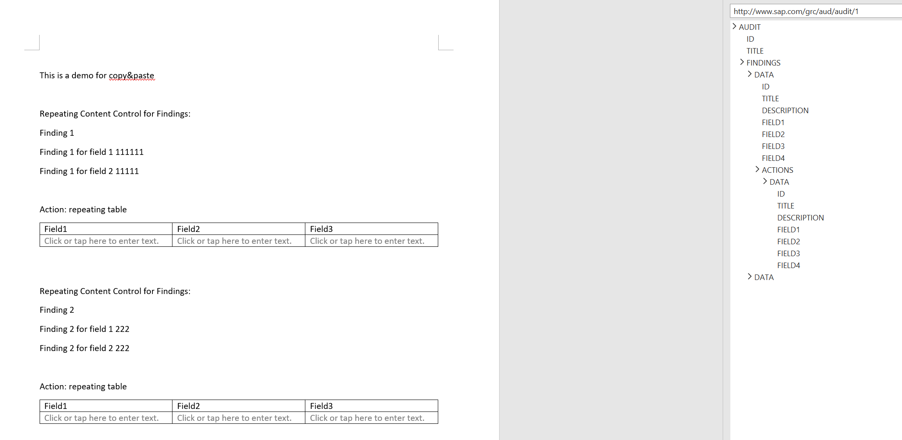
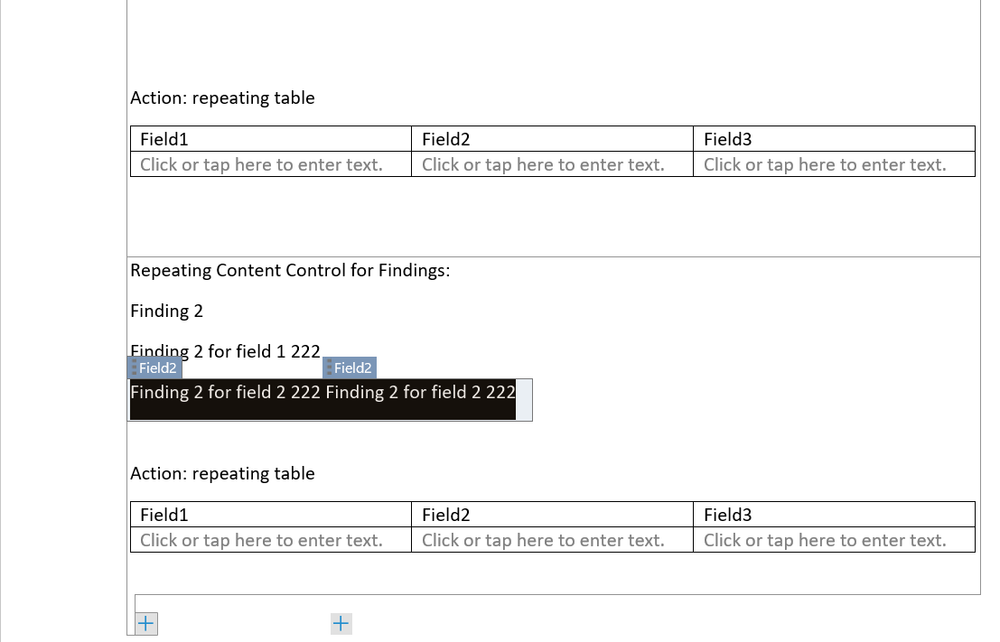
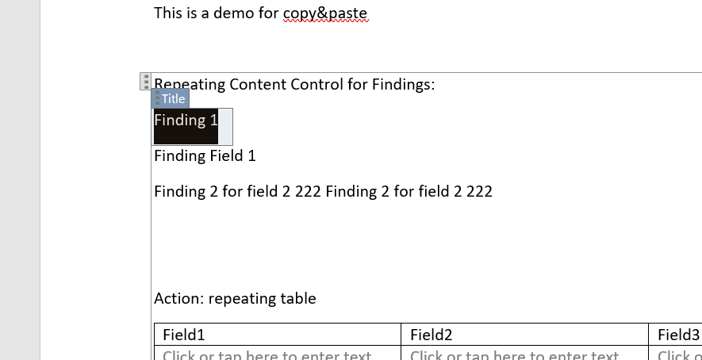
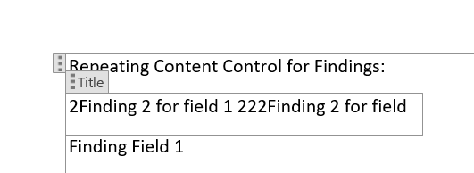

# Work Report Issue when Copy and past
We are using content control to bind XML Data. Here is a sample of XML structure. I create a repeating content control to show fields for Finding and create a table in this content control to show fields for actions.
`
<Root>
        <FINDING>
              <Fields1/>
              <Actions>
                   <Field1/>
               <Actions>
        </FINDING>
</Root>
`
Our report looks like this:

# Issue
## Random text being pasted
### Reproduce Steps
1. More than one Finding needs to exist
2. Select entire content of a field from Finding 2  & copy 
3. Select field from a Finding 1 & delete entire contents
4. Paste into this field using ctrl & v
5. Random text taken from somewhere else
before copy: 

delete text first

paste text usign ctrl&v, then random text being pasted

## Issue when changing from Merge Formatting to Keep Source Formatting
### Reproduce Steps
1. Set Merge Formatting as default paste option
2. Copy entire text from field in Finding or Action Plan
3. If you paste into field with no text already entered using ctrl &v, then change to Keep Source Formatting using change paste option popup, result is that nothing will paste & field remains blank
4. If you are pasting into a field which has text in it already, first delete the text, paste using ctrl & v, then change to KSF, and result is that field either disappears or jumps to another part of the Finding. Usually it just disappears
5. Clicking undo does not fix anything except remove the field in cases where it jumped instead of immediately disappearing
